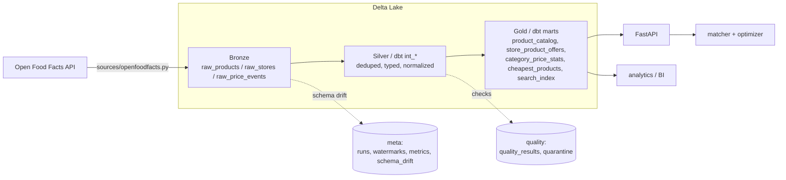
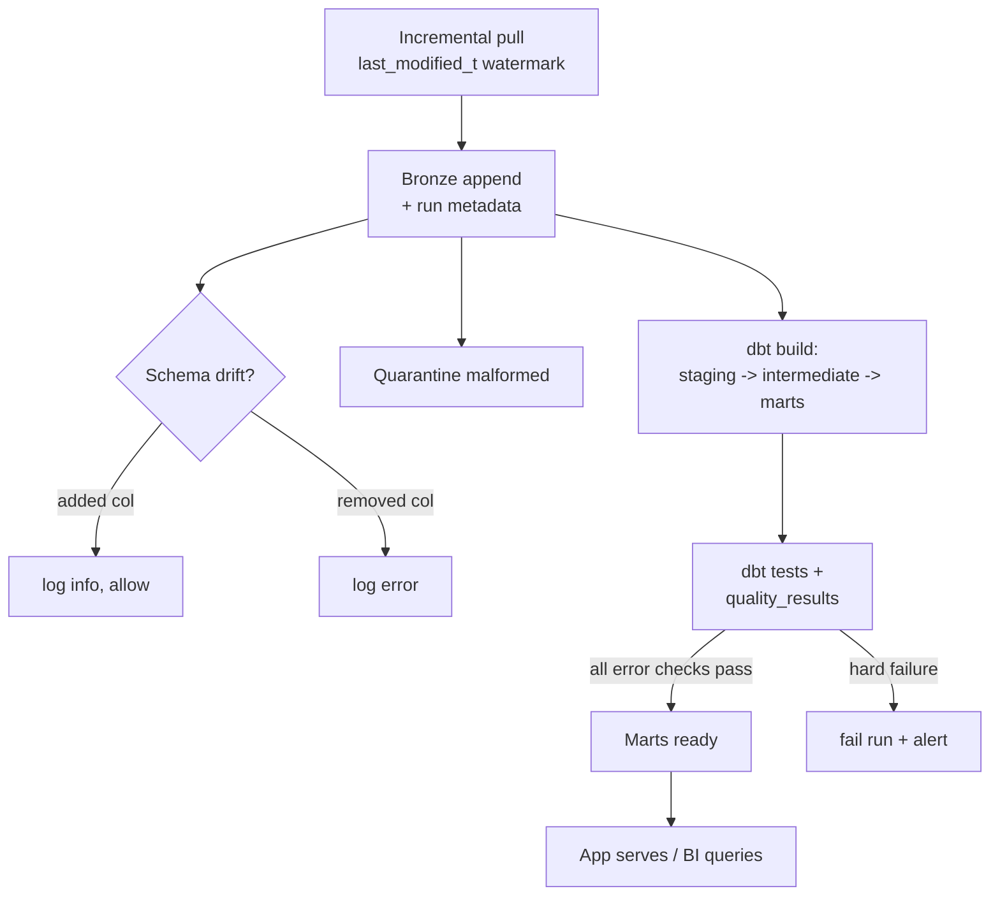
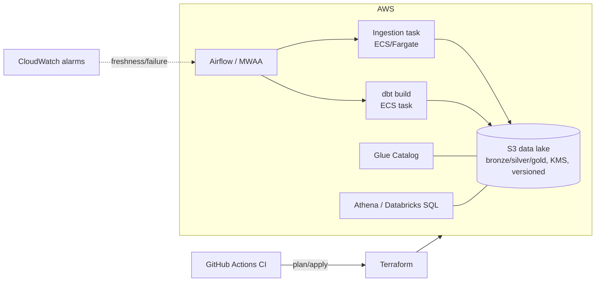
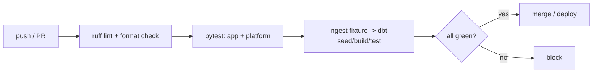

# Architecture

smart-cart is a data platform with a small application on top. The platform ingests
real product data, refines it through a medallion lakehouse, validates it, and serves
governed marts; the grocery optimizer is one consumer of those marts.

## Components (current)

dbt owns the transforms (staging -> intermediate -> marts); Python owns ingestion
(extract + load) and serving. dbt reads the Bronze Delta tables via DuckDB `delta_scan`.

## Data flow

## Target cloud architecture (AWS)

Environment isolation (dev/stage/prod) is enforced by separate Terraform state,
buckets, and IAM roles (`infra/`).

## CI/CD

`.github/workflows/ci.yml` runs lint, tests, and a full dbt build+test on the
committed real-data sample, so data-quality regressions block the merge.

## Layer-to-platform mapping

| This repo (local, free) | AWS | Databricks / Snowflake |
|--|--|--|
| Delta via delta-rs | Delta on S3 | Delta Lake / Iceberg |
| DuckDB + dbt | dbt on ECS, Athena | Spark/Photon, Snowflake |
| Airflow DAG | MWAA / Composer | Workflows / DLT, Tasks |
| watermark + MERGE | same | Structured Streaming + MERGE / Streams+Tasks |
| quality_results + dbt tests | same + CloudWatch | DLT expectations / Snowflake DMFs |
| meta tables | + Glue/Unity lineage | Unity Catalog / Horizon |
| Terraform | Terraform | Terraform |

## Production practices

- **Configuration**: all tunables in `app/config.py`; pipeline paths in
  `app/ingestion/paths.py`; environment-specific values via env vars
  (`SMARTCART_LAKE`, dbt `profiles.yml` targets dev/prod).
- **Secrets**: none committed; cloud credentials come from the runtime role
  (IAM via `infra/`), API keys from env/secret store, never source.
- **Error handling**: ingestion retries with backoff and isolates per-source
  failures (one bad category does not fail the run); the run status is recorded.
- **Logging/observability**: every run writes to `ingestion_runs`, `ingestion_metrics`
  (row counts, freshness), `schema_drift`, and `quality_results`; the report module
  and freshness task act as gates.
- **Testing**: `pytest` for app + platform behavior, dbt tests for data contracts,
  ruff for style; all enforced in CI.

## Design decisions

- **dbt for T, Python for EL**: transforms are declarative SQL with tests and lineage;
  extraction/landing stays in Python where retries and API logic live.
- **Bronze append-only, Silver MERGE**: replayable raw history plus a small current-
  state layer; reprocessing always starts from Bronze.
- **Quarantine over drop**: bad records are inspectable and replayable, not lost.
- **Additive schema evolution allowed, removals flagged**: new upstream fields don't
  break ingestion; removed fields surface loudly because models depend on them.
- **Modeled pricing behind a seam**: no free price API exists, so pricing is modeled
  on the real product master and isolated to one module for a clean swap.
