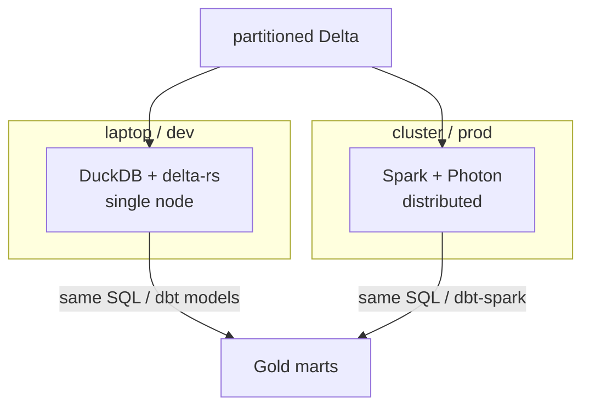

# Scale

How the platform behaves as data grows, and which techniques carry it from a laptop
to a cluster. Numbers below are from `python scripts/scale_simulation.py` on a laptop.

## Scale simulation (2,000,000 price events)

```
wrote 2,000,000 rows partitioned by event_date in ~0.8s
PARTITION PRUNING:  1200 files | full scan 54 ms | one-day pruned 15 ms (3.6x faster)
COMPACTION:         1200 -> 30 files (removed 1200)
                    full scan after compaction 17 ms (3.1x faster than 1200 small files)
summary: partitioning skips ~97% of data per day; compaction cut files 40x, full scans 3.1x.
```

Two independent levers, both measurable here and both scale-invariant:

- **Partition pruning**: querying one of 30 days opens ~1/30 of the files. At billions
  of rows that is the same fraction of bytes scanned, I/O, and compute billed.
- **Compaction**: many small files (one per micro-batch per partition) are slow to
  list and open; rewriting them into a few large files sped the full scan ~3x. This is
  the small-file problem every streaming sink eventually hits.

## Scale architecture



The transforms are SQL (dbt models) and the storage is open Delta, so the same logic
runs on either engine. DuckDB is faster on a laptop (no JVM, no shuffle); Spark wins
once the data does not fit one machine.

## Distributed processing (Spark)

`spark/` contains real PySpark + Delta jobs:

- `stream_bronze.py` - Structured Streaming Kafka -> Bronze (checkpointed, exactly-once).
- `batch_silver.py` - Bronze -> Silver with a window dedup and a partition-pruning
  filter, the same logic as the dbt model expressed in the DataFrame API.

They run in the Spark container (`docker compose --profile spark up`) because Spark
needs a JVM; no local Java required. On a 2M-row laptop dataset Spark would be *slower*
than DuckDB (cluster overhead), which is exactly why this repo benchmarks the
single-node path and reserves Spark for the distributed story rather than faking a
cluster on tiny data.

## How it maps to Databricks / Snowflake

| here | platform |
|------|----------|
| partition by category/date | partitioning / liquid clustering |
| `optimize.compact()` | `OPTIMIZE`, auto-compaction |
| `optimize.z_order()` | `OPTIMIZE ... ZORDER BY` |
| DuckDB SQL / dbt models | Spark SQL / Photon, Snowflake, dbt-spark (unchanged) |
| Structured Streaming + checkpoints | the same, managed |
| at-least-once + MERGE dedup | Streams + Tasks / DLT exactly-once |

## Tradeoffs

- **Partition cardinality**: low-cardinality keys (category, date) prune well and avoid
  the small-file problem; partitioning by a high-cardinality key (per-barcode) would
  explode file/metadata count. Match partitions to query predicates.
- **Compaction cadence**: too frequent wastes compute rewriting; too rare leaves small
  files. Run it on a schedule after ingestion (the Airflow DAG's optimize task).
- **DuckDB vs Spark**: don't pay cluster overhead until you have to. The portable SQL
  means switching engines is a config change, not a rewrite.
