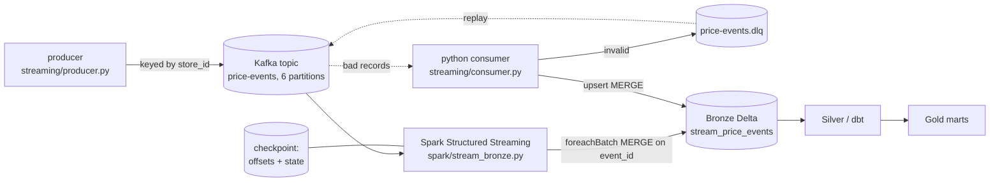

# Streaming lakehouse

The batch ingestion (Open Food Facts -> Bronze -> dbt) stays as-is. This adds a
real-time path for the price-event stream: Kafka -> Spark Structured Streaming ->
Bronze Delta, which then flows through the same Silver/Gold models.

## Architecture



Two consumers are provided on purpose: a **Spark Structured Streaming** job (the
scale path, in the container) and a **pure-Python consumer** (`kafka-python`, runs
anywhere, fully unit-tested). Both write the same Bronze table with an idempotent
MERGE on `event_id`.

## Kafka concepts used

- **Topics + partitions**: `price-events` has 6 partitions; events are keyed by
  `store_id` so a store's events stay ordered within a partition and parallelism is
  bounded by partition count.
- **Consumer groups + offsets**: the loader commits offsets manually, only after the
  sink write succeeds (at-least-once). Combined with the idempotent MERGE sink, the
  end-to-end effect is exactly-once.
- **Dead-letter queue**: unparseable or schema-invalid records go to
  `price-events.dlq` with the reason, instead of crashing the consumer or being lost.
- **Replay**: `streaming/replay.py` seeks consumers to a timestamp or offset to
  reprocess history (rebuild Bronze after a fix) or drain the DLQ back through.
- **Schema versioning**: every event carries `schema_version`; the consumer validates
  against that version and upgrades v1 -> v2, so producers and consumers can deploy
  independently (`streaming/schemas.py`).

## Spark Structured Streaming concepts used

- **Checkpointing**: Kafka offsets and operator state are written to
  `checkpointLocation`, so a restart resumes without loss or double-processing.
- **Exactly-once**: `foreachBatch` + a Delta MERGE on `event_id` makes batch retries
  idempotent; checkpointing makes offset handling exactly-once.
- **Watermarking**: `withWatermark("event_ts", "1 hour")` bounds the state kept for
  late events, so memory does not grow unbounded.

## Tradeoffs and design decisions

- **Two consumers**: the Python consumer is testable and runs without a JVM, which is
  ideal for development and CI; Spark is the production scale path. Same Bronze table,
  same MERGE key, so they are interchangeable.
- **At-least-once + idempotent sink** instead of Kafka transactions: simpler, and the
  natural business key (`event_id`) makes dedup trivial. Full Kafka EOS transactions
  add overhead and are only needed when there is no idempotency key.
- **DLQ over fail-fast**: a single poison message should not halt ingestion; isolating
  it keeps the stream flowing and makes bad data inspectable and replayable.
- **Bronze stays append/MERGE, not the source of truth for analytics**: Silver/Gold
  still own current state, so streaming and batch converge on the same marts.

## Run it locally (one command, only Docker required)

```bash
docker compose up --build
```

That starts Kafka + UI (http://localhost:8080), creates the topics, runs the producer
(feeds 2000 events including v1, invalid, and malformed), and runs the Python consumer,
which writes valid events to Bronze Delta (`data/lake/bronze/stream_price_events`) and
routes bad records to the DLQ. Everything runs in containers; nothing is installed on
the host except Docker.

```bash
docker compose --profile spark up --build    # use the Spark Structured Streaming engine
```

To run the Python clients directly instead of in containers:

```bash
pip install -r requirements-streaming.txt
python -m streaming.produce_demo 2000
python -m streaming.run_consumer
```
